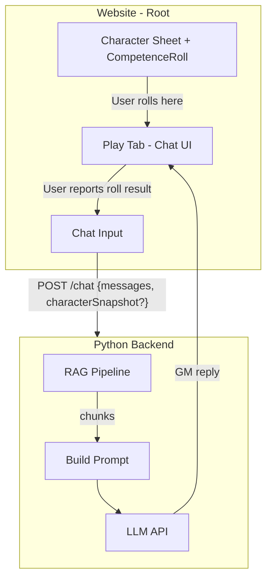

# LLM Game Master MVP for Des Récits Discordants

## Scope and principles

- **RAG-first**: Use the rulebook/lore as a knowledge base. No fine-tuning.
- **Hybrid mechanics**: LLM narrates and calls for rolls; **code handles dice** (existing [CompetenceRoll.ts](src/game/dice/CompetenceRoll.ts) + Character Sheet). MVP: user rolls in Character Sheet and types the result in chat.
- **Minimal backend**: Single Python service (FastAPI) with RAG + LLM. No auth, no DB for sessions.
- **Reuse website**: Add a "Play" tab; keep existing tabs, Character Sheet, and styling.

---

## Architecture

**Data flow**

1. User writes action in Play tab → `POST /chat` with `messages` and optional `characterSnapshot`.
2. Backend runs RAG over last user message (or recent context), builds system prompt with rules/lore chunks, calls LLM, returns GM reply.
3. GM may say e.g. "Roll [Négociation] vs Niv +2." User opens Character Sheet, rolls, then types the outcome in chat (e.g. "I got +3, success") and sends.
4. Conversation continues; backend is stateless per request.

---

## 1. RAG pipeline (backend)

**Source content**

- Use [reference/TTRPG - Des Récits Discordants/systeme_drd/](reference/TTRPG%20-%20Des%20R%C3%A9cits%20Discordants/systeme_drd/) (rules, lore, LIVRET, Quick Start, etc.).
- Optionally include `book_extracted/00_FULL_BOOK.md` or selected `page_*.md` if you want fuller lore; MVP can start with `systeme_drd` only.

**Chunking**

- One chunk per Markdown file, or split by `##` sections within files. No semantic overlap for MVP.
- Attach metadata: `source` (filename), optional `section` for targeted retrieval later.

**Embeddings + vector store**

- Embedding model: **OpenAI `text-embedding-3-small`** (or `all-MiniLM-L6-v2` if you prefer local).
- Vector store: **ChromaDB** (local, simple). Persist under e.g. `backend/chroma_drd`.
- Index built once (script or on first run); reuse for all requests.

**Retrieval**

- Query: last user message (and optionally a short summary of recent turns).
- Top-k retrieval (e.g. k = 5–8). No reranker for MVP.

**Stack**

- Python 3.10+, FastAPI, LangChain or LlamaIndex for loaders + ChromaDB + OpenAI (or alternative) for embeddings and LLM.

---

## 2. Backend API

**Location**: New `backend/` directory at project root.

**Endpoints**

- `GET /health`: Simple liveness check.
- `POST /chat`:  
  - Body: `{ "messages": [{"role":"user"|"assistant","content":"..."}], "characterSnapshot": {...} }`  
  - `characterSnapshot` optional: minimal character data (attributes, key competences, souffrances) from [CharacterSheetManager](src/game/character/CharacterSheetManager.ts) / [simulationStorage](src/lib/simulationStorage.ts) to give the GM context.  
  - Flow: RAG retrieve → build system prompt with chunks + GM instructions → call LLM → return `{ "reply": "..." }`.  
  - No streaming for MVP.

**Config (env)**

- `OPENAI_API_KEY`, `OPENAI_MODEL` (or equivalent for another provider).
- `RAG_SOURCE_DIR`: path to `reference/TTRPG - Des Récits Discordants/systeme_drd` (and optionally other dirs).
- `CHROMA_PATH`: where to store/load ChromaDB index.

**CORS**

- Allow the frontend origin (e.g. `http://localhost:5173`, or wherever you serve the site) so the Play tab can call the API.

---

## 3. System prompt and GM behaviour

**System prompt (concise)**

- You are the **Éveilleur (GM)** for **Des Récits Discordants**. Use **only** the provided rules and lore. Never invent mechanics.
- When a roll is needed, say explicitly: **"Roll [Compétence] vs Niv ±X."** and wait for the player to report the result.
- Keep tone and setting consistent with the world (Iäoduneï, Rils, Peoples, etc.).
- Optional: "Step 1: Check rules. Step 2: Apply lore. Step 3: Respond." to encourage consistency.

**Injected context**

- Retrieved RAG chunks.
- Optionally a short "Current character" blurb from `characterSnapshot` (e.g. people, attributes, a few competences, current souffrances).

---

## 4. Frontend: Play tab and chat

**HTML**

- Add a "Play" nav item with `data-tab="play"` and `href="#play"`.
- Add a `#play` section with `class="tab-content"` containing:
  - A chat container (scrollable list of messages).
  - A text input + "Send" button.
  - Optional: "Use current character" checkbox; when checked, include `characterSnapshot` in `/chat` requests (from `sessionStorage` via `simulationStorage` / Character Sheet state).

**JS**

- New `js/gm-chat.js` (or equivalent):
  - Wire Play tab into existing tab logic in [dtd-interactive.js](js/dtd-interactive.js) (add `play` to `validTabs`, reuse `switchTab`).
  - On submit: append user message to local `messages`, `POST /chat`, append assistant reply, update UI.
  - Store `messages` in memory (or `sessionStorage`) for the session. No backend session DB.
- **API base URL**: configurable (e.g. `window.GM_API_URL` or a small config object), default e.g. `http://localhost:8000` for local dev.

**Rolls (MVP)**

- User rolls in the **existing Character Sheet** (Rules tab → "Open Character Sheet" → use simulation/roll UI).
- User types the result into the Play chat (e.g. "Rolled [Négociation]: +3 vs +2, success") and sends.
- No parsing of GM output, no dedicated "Roll" button in the Play tab for MVP.

---

## 5. Files to add or change

**New**

- `backend/main.py`: FastAPI app, `/health`, `/chat`, CORS.
- `backend/rag.py`: Load MDs from `RAG_SOURCE_DIR`, chunk, embed, build ChromaDB index, `retrieve(query, k)`.
- `backend/requirements.txt`: fastapi, uvicorn, langchain, langchain-openai, chromadb, python-dotenv, etc.
- `backend/.env.example`: `OPENAI_API_KEY`, `OPENAI_MODEL`, `RAG_SOURCE_DIR`, `CHROMA_PATH`.
- `js/gm-chat.js`: Play tab logic, chat UI, fetch `/chat`, optional `characterSnapshot`.

**Modified**

- [index.html](index.html): Nav item "Play", `#play` section (chat + input + optional checkbox), `<script src="js/gm-chat.js">`.
- [js/dtd-interactive.js](js/dtd-interactive.js): Add `play` to `validTabs` so `#play` works with hash/tab switching.

**Unchanged**

- Character Sheet, [CompetenceRoll](src/game/dice/CompetenceRoll.ts), [CharacterSheetManager](src/game/character/CharacterSheetManager.ts), [simulationStorage](src/lib/simulationStorage.ts), existing Roll/Simulation UI. No backend roll endpoint for MVP.

---

## 6. Running the MVP

1. **Backend**: `cd backend && pip install -r requirements.txt`, set `.env`, run `uvicorn main:app --reload`. Ensure ChromaDB index exists (build via RAG script or on startup).
2. **Frontend**: Serve the site (e.g. Vite dev server or static server) with `GM_API_URL` pointing at the backend.
3. Open site → Play tab → chat with GM. Use Character Sheet for rolls; report results in chat.

---

## 7. Optional later improvements (out of MVP)

- Roll UI inside Play tab (reuse `rollCompetenceCheck` + manager), and/or parsing "Roll [X] vs Niv Y" to pre-fill and post result into chat.
- Streaming GM replies.
- `characterSnapshot` schema and parsing standardized between frontend and backend.
- Extra RAG sources (e.g. `book_extracted`), reranker, or chunking tweaks.

---

## Summary

| Component | MVP choice |

|-----------|------------|

| **RAG** | `systeme_drd` MDs → chunk by file/section → ChromaDB + OpenAI embeddings |

| **LLM** | Single provider (OpenAI or env-configurable alternative) |

| **Rolls** | User rolls in Character Sheet, reports in Play chat |

| **State** | In-memory (or sessionStorage) messages; optional characterSnapshot per request |

| **Backend** | Python FastAPI, `/health` + `/chat`, stateless |

This keeps the MVP small, reuses your existing mechanics and UI, and aligns with your research (RAG for rules/lore, code for dice, simple state).