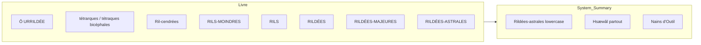

# Lore terminology corrections — Book vs System_Summary

## Scope

- **Canonical source**: [reference/TTRPG_DRD/AllBookPages-FullBook](reference/TTRPG_DRD/AllBookPages-FullBook) (pages 1–145, especially 10–12, 23–24, 34, 44, 120–122).
- **Target**: [reference/TTRPG_DRD/System_Summary](reference/TTRPG_DRD/System_Summary) (LORE_01, LORE_02, LORE_03, LORE_05, 07_Rilie, PRESENTATION_*, _SOURCE_MAPPING, 05_Souffrances, etc.).

---

## 1. Terminology verified as correct (no change)

- **Ô**, **WÔM**, **HISM**, **Éo**, **oÀ**, **ÉoÀ** — used consistently; _SOURCE_MAPPING already states these.
- **Tétrarques** (assembly of the four) vs **tétraques** (bicephalous entities): book uses both; System_Summary uses “tétrarques” and “tétraques bicéphales” correctly (e.g. [LORE_01_Cosmogonie_Divinites.md](reference/TTRPG_DRD/System_Summary/LORE_01_Cosmogonie_Divinites.md) lines 33, 348).
- **Ril-cendrée(s)** with hyphen; **Rils-cendrées** for the category in the 8 ordres — matches book (e.g. page_121 “Rils - cendrées”).
- **Hylsyôrres** (ancestors), **Hypsyôrre** (Hauts Ylfes), **Hydryôrres**, **Izkyôrres**, **Albyôrre**, **Limnyôrre** — spellings match book.
- **Pauk Peytsk** (book has one typo “Peystk” on page_121; canonical is Peytsk).
- **Aèmrils**, **Ormrils**, **Esthrils**, **Stadrils**, **Physrils**, **Zoosrils**, **Hygrils**, **Noûsrils** — book and summary align.
- **Môh** in body text (book ToC uses “Môi” for the section “Honorations Riliques Hôi, Iôs, Sôm, Môi”; narrative always **Môh**; keep Môh in summaries).

---

## 2. Corrections to apply

### 2.1 Rildées-astrales (lowercase “astrales”)

- **Book**: “Rildées-astrales”, “Rildées - astrales” (lowercase *astrales*).
- **System_Summary**: Uses “Rildées-Astrales” (capital A) in headings/lists in [LORE_01_Cosmogonie_Divinites.md](reference/TTRPG_DRD/System_Summary/LORE_01_Cosmogonie_Divinites.md) (e.g. lines 50, 61, 72, 83, 98).
- **Action**: Normalize to **Rildées-astrales** (lowercase *astrales*) everywhere in System_Summary, including section titles like “Les Rildées-Astrales (8 Lunes…)”.

### 2.2 Hsæwâl vs Hsaewâl

- **Book**: Narrative and most refs use **Hsæwâl** (e.g. “Les 4 Abondances de Hsæwâl”, “Hsæwâl sema”); table headers in 00_FULL_BOOK use “Hsaewâl” in one place.
- **System_Summary**: Uses Hsæwâl everywhere except one list: [LORE_01_Cosmogonie_Divinites.md](reference/TTRPG_DRD/System_Summary/LORE_01_Cosmogonie_Divinites.md) line 346 lists “Hsaewâl” in the 8 Lunes WYTHSMÂH.
- **Action**: In that line only, replace **Hsaewâl** with **Hsæwâl** so the full list is (Währos, Yekkwuî, Tëhkswen, **Hsæwâl**, Samianâ, Minzhijë, Âpsebjum et Hwëthioz).

### 2.3 Nains d’Outil (singular)

- **Book**: “Herwâs Thars ( ‘Nains ‘ d’Outil )” — singular **d’Outil** (page_044, page_034).
- **System_Summary**: “Nains d’Outils” in [LORE_01_Cosmogonie_Divinites.md](reference/TTRPG_DRD/System_Summary/LORE_01_Cosmogonie_Divinites.md) (lines 245, 247) and [LORE_05_Chronologie_Complete.md](reference/TTRPG_DRD/System_Summary/LORE_05_Chronologie_Complete.md) (line 81).
- **Action**: Replace **Nains d’Outils** with **Nains d’Outil** in those files. (Leave 16_GM “Niv d’Outil” as is — that is a game term.)

### 2.4 Samianâ cycle — remove non-canonical “25ème Aube”

- **Book**: Only one Samianâ cycle: “après chaque **24** ème Aube , Samianâ la cinquième calme ses bêtes à la traite pour s’abreuver de son addiction, avant de succomber aux arcanes du sevrage imminent.” (page_024, 00_FULL_BOOK.)
- **System_Summary**: [LORE_01_Cosmogonie_Divinites.md](reference/TTRPG_DRD/System_Summary/LORE_01_Cosmogonie_Divinites.md) has both the correct 24ème Aube (line 127) and an extra “**Cycle** : Après chaque **25**ème Aube (5 Pentaines), Samianâ la cinquième, se rassasie de ses troupeaux…” (line 134) which does not appear in the book.
- **Action**: Remove the “25ème Aube” cycle line (and the duplicate “Cycle” block for Samianâ that contains only that line), or replace it with a note that the book only specifies the 24ème Aube (traite/sevrage). Prefer: delete the 25ème Aube sentence so Samianâ has a single cycle consistent with the book.

### 2.5 Yzkyôrres → Izkyôrres (if present)

- **Book**: Uses **Izkyôrres** for the “errants”; page_034 has one instance “Yzkyôrres”.
- **Action**: If any System_Summary file uses “Yzkyôrres”, replace with **Izkyôrres**. (Grep showed System_Summary already uses Izkyôrres; confirm and fix only if needed.)

### 2.6 Optional: “Honorations Riliques Hôi, Iôs, Sôm, Môi”

- **Book**: Section title in ToC is “Honorations Riliques Hôi, Iôs, Sôm, **Môi**” (with *i*); body text always **Môh**. Likely a book typo/variant in the title.
- **Action**: No change in System_Summary (keep **Môh**). Optionally add a one-line note in _SOURCE_MAPPING or LORE_01 that the book ToC uses “Môi” for that section title.

---

## 3. Files to touch (summary)

| File | Changes |

|------|--------|

| **LORE_01_Cosmogonie_Divinites.md** | Rildées-Astrales → Rildées-astrales; Hsaewâl → Hsæwâl (line 346); Nains d’Outils → Nains d’Outil; remove or correct Samianâ 25ème Aube cycle (line 134). |

| **LORE_02_Origines_Peuples.md** | Nains d’Outil if “d’Outils” appears. |

| **LORE_05_Chronologie_Complete.md** | Nains d’Outils → Nains d’Outil. |

| **07_Rilie_Magie.md** | Rildées-astrales lowercase if used in headings. |

| **PRESENTATION_*.md**, **00_INDEX.md** | Rildées-astrales lowercase where applicable. |

| **_SOURCE_MAPPING.md** | Optional: note “Môi” in book ToC vs Môh in body. |

---

## 4. Diagram (book vs summary — Ril hierarchy)

---

## 5. Verification after edits

- Grep System_Summary for: `Rildées-Astrales`, `Hsaewâl`, `d'Outils`, `25.ème Aube`, `Yzkyôrres` and ensure no unintended leftovers.
- Cross-check [ _SOURCE_MAPPING.md](reference/TTRPG_DRD/System_Summary/_SOURCE_MAPPING.md) terminology list (line 66) still matches: Ril-cendrée, Rildée-astrale, HISM, Éo, oÀ, ÉoÀ.