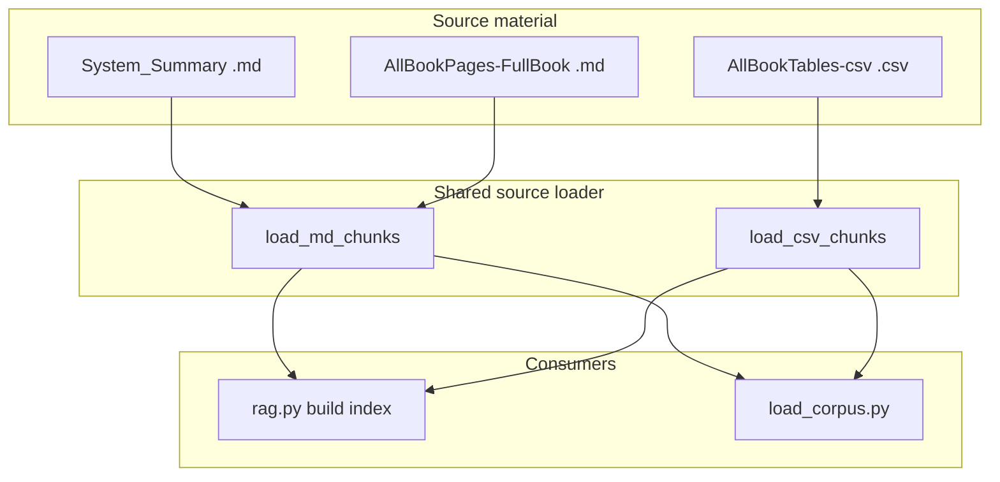

# Retrain LLM Chatbox Context and Training Data on Updated DRD Sources

## Scope

- **RAG (chatbox context):** Rebuild the FAISS index from **System_Summary**, **AllBookPages-FullBook**, and **AllBookTables-csv** (replacing `systeme_drd`).
- **Training pipeline:** Regenerate `corpus.jsonl`, `train.jsonl`, `debiasing.jsonl`, and `train_combined.jsonl` from the same three sources.
- **No model fine-tuning** in this plan; only data prep and RAG indexing.

## Current vs desired state

| Component | Current | Target |

|-----------|--------|--------|

| RAG source | Single dir `systeme_drd` (missing), `.md` only | System_Summary + AllBookPages-FullBook + AllBookTables-csv |

| Training corpus | `systeme_drd` + optional `book_extracted` | Same three dirs, including CSV |

| CSV | Not used | Ingested as chunks (one per file), UTF-8 |

## Architecture

## Implementation plan

### 1. Shared source-loading module

Add a small **project-root** module used by both RAG and training (e.g. `tools/drd_sources.py` or `lib/drd_sources.py`). It will expose:

- **`load_md_chunks(dir_path, *, chunk_by_h2=True, fallback_full_page=False) -> list[dict]`**  
  - Same structure as today: `{"source": filename, "section": section, "content": text}`.  
  - `chunk_by_h2`: split on `##` when present; else `fallback_full_page`: one chunk per file.  
  - For **System_Summary**: always `chunk_by_h2=True`, `fallback_full_page=False`.  
  - For **AllBookPages-FullBook**: `chunk_by_h2=True`, `fallback_full_page=True` (page as chunk when no `##`). Optionally skip `00_INDEX.md` / `00_FULL_BOOK.md` if they are mostly navigation, or include them as single chunks.

- **`load_csv_chunks(dir_path) -> list[dict]`**  
  - One chunk per CSV file. Use stdlib `csv` + `utf-8` / `utf-8-sig` for encoding.  
  - Convert each CSV to a **markdown table** (or a simple structured text representation) so it fits the existing “text chunk” pipeline.  
  - `source` = filename, `section` = `"table"` or the sanitized table name.  
  - For very large tables (e.g. Niv_de_Guérison), **cap content length** (e.g. 10k–12k chars) and truncate with a note to avoid huge chunks; optionally split into multiple chunks later if needed.

- **`default_source_dirs() -> tuple[Path, Path, Path]`**  
  - Returns `(System_Summary, AllBookPages-FullBook, AllBookTables-csv)` under `reference/.../TTRPG - Des Récits Discordants/`, using the same TTRPG-folder resolution as today (glob by `"TTRPG"` in name).

`load_corpus` and RAG will call these helpers and merge results. Decide whether to add a **`tools`** or **`lib`** package at project root and fix imports (e.g. `sys.path` or package layout) so both `backend` and `training` can import it when run from project root.

### 2. RAG ([backend/rag.py](backend/rag.py))

- **Multi-dir source:**  
  - Replace single `_default_source_dir()` with logic that uses **default three dirs** from the shared module when `RAG_SOURCE_DIR` is unset.  
  - Support **`RAG_SOURCE_DIR`** (env): optional override. Two options:  
    - **A)** Comma-separated list of directories (relative to project root). Each can be System_Summary, AllBookPages, or AllBookTables; RAG loads .md from the first two and .csv from the third.  
    - **B)** Single root directory that contains three subdirs `System_Summary`, `AllBookPages-FullBook`, `AllBookTables-csv`; RAG loads from those.  
  - Implement one of (A) or (B) and document it in README.

- **Loading:**  
  - Use the shared `load_md_chunks` for System_Summary and AllBookPages, and `load_csv_chunks` for AllBookTables.  
  - Convert each `dict` to a LangChain `Document` (`page_content` = `content`, `metadata` = `source` / `section`).  
  - Concatenate all document lists, then build FAISS from the combined list.

- **`build_or_get_index`:**  
  - Resolve source dirs via env or defaults **before** loading.  
  - If `FAISS_PATH` / `RAG_FORCE_REBUILD` already exist, keep current behavior (force rebuild clears FAISS, then rebuild).

- **`main.py`:**  
  - Keep passing no args to `build_or_get_index()`; RAG reads config from env internally. Optional: pass `source_dirs` from `main` if we centralize config there later.

### 3. Training pipeline

- **[training/load_corpus.py](training/load_corpus.py):**  
  - Remove `systeme_drd` / `book_extracted`.  
  - Add flags: `--system-summary-dir`, `--book-dir`, `--csv-dir` (optional paths). Defaults: use `default_source_dirs()` from the shared module.  
  - For each default (or overridden) dir that exists: call `load_md_chunks` or `load_csv_chunks`, merge into one list of `{source, section, content}`.  
  - Write `corpus.jsonl` in the same format as today.

- **[training/generate_qa_dataset.py](training/generate_qa_dataset.py):**  
  - No changes to I/O or format. It already reads `corpus.jsonl` and writes `train.jsonl` / `debiasing.jsonl`.  
  - Optional: ensure truncation (`content[:4000]` or similar) still works well with CSV-derived chunks; adjust if we use a different cap.

- **Regenerate outputs:**  
  - Run `load_corpus` → `corpus.jsonl`.  
  - Run `generate_qa_dataset` (template and optionally debiasing) → `train.jsonl`, `debiasing.jsonl`.  
  - Rebuild `train_combined.jsonl` via the existing merge snippet (concatenate `train.jsonl` + `debiasing.jsonl`).

### 4. Chunking and skipping rules

- **System_Summary:** Split by `##`; one chunk per section. No fallback to full file.  
- **AllBookPages-FullBook:** Split by `##` when present; otherwise one chunk per page. Skip `00_INDEX.md` and `00_FULL_BOOK.md` if they are pure navigation, or include as single chunks; decide and document.  
- **AllBookTables-csv:** One chunk per file. Content = markdown table (or equivalent). Cap size; truncate with a short note if over limit.

### 5. Config and docs

- **[backend/.env.example](backend/.env.example):**  
  - Update `RAG_SOURCE_DIR` comment to describe the new semantic (override for source dirs) and that the default is the three updated dirs.

- **[backend/README.md](backend/README.md):**  
  - **RAG source:** State that the index is built from **System_Summary**, **AllBookPages-FullBook**, and **AllBookTables-csv**.  
  - Explain how to **rebuild** after changes (delete `faiss_drd` or `RAG_FORCE_REBUILD=1`).  
  - Document `RAG_SOURCE_DIR` override if implemented.

- **[training/README.md](training/README.md):**  
  - Update “Phase 2: Data preparation” to use the new dirs and flags.  
  - Document that **CSV** is included, and the order of steps: `load_corpus` → `generate_qa_dataset` → merge to `train_combined.jsonl`.

### 6. Rebuild and validation

- Delete `backend/faiss_drd` (or set `RAG_FORCE_REBUILD=1`), then start backend and trigger a `/chat` to rebuild the index.  
- Run `load_corpus` and `generate_qa_dataset` (plus merge) and confirm `corpus.jsonl`, `train.jsonl`, `debiasing.jsonl`, and `train_combined.jsonl` are regenerated.  
- Spot-check: RAG retrieval returns chunks from System_Summary, AllBookPages, and CSVs; corpus/train contain rows from all three sources.

## File-level summary

| File | Action |

|------|--------|

| **New** `tools/drd_sources.py` or `lib/drd_sources.py` | Shared `load_md_chunks`, `load_csv_chunks`, `default_source_dirs` |

| [backend/rag.py](backend/rag.py) | Multi-dir sources, CSV ingestion, optional `RAG_SOURCE_DIR`, use shared loader |

| [training/load_corpus.py](training/load_corpus.py) | Switch to System_Summary + AllBookPages + AllBookTables, add `--*‑dir` flags, use shared loader |

| [training/generate_qa_dataset.py](training/generate_qa_dataset.py) | No change (or minor truncation tweaks if needed) |

| [backend/.env.example](backend/.env.example) | Update `RAG_SOURCE_DIR` description |

| [backend/README.md](backend/README.md) | RAG source = three dirs, rebuild steps, `RAG_SOURCE_DIR` |

| [training/README.md](training/README.md) | New defaults, `--*‑dir`, CSV, regenerate steps |

| `backend/faiss_drd` | Delete before rebuild (or use `RAG_FORCE_REBUILD`) |

| `training/corpus.jsonl`, `train.jsonl`, `debiasing.jsonl`, `train_combined.jsonl` | Regenerate via scripts |

## Dependencies

- Use **stdlib `csv`** for CSV parsing; **no new dependencies**.  
- If we later need more robust CSV handling (e.g. pandas), we can add it in a follow-up.

## Optional follow-ups (out of scope)

- **RAG_SOURCE_DIR** as multiple explicit dirs (e.g. `RAG_SOURCE_SYSTEME`, `RAG_SOURCE_BOOK`, `RAG_SOURCE_CSV`).  
- Splitting very large CSV files into multiple chunks.  
- Fine-tuning a model on the new `train_combined.jsonl`.