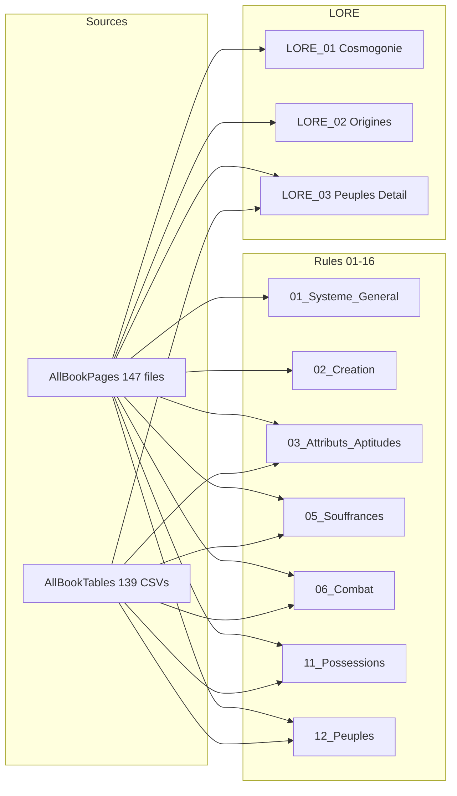

# Plan: Review and Update TTRPG System_Summary from Full Book and CSV Tables

## Scope

- **Sources**: [AllBookPages-FullBook](reference/TTRPG%20-%20Des%20Récits%20Discordants/AllBookPages-FullBook) (147 files: 00_INDEX, 00_FULL_BOOK, page_001–page_145) and [AllBookTables-csv](reference/TTRPG%20-%20Des%20Récits%20Discordants/AllBookTables-csv) (139 CSV files).
- **Targets**: All files in [System_Summary](reference/TTRPG%20-%20Des%20Récits%20Discordants/System_Summary): 00_INDEX, 01–16 (rules), GUIDE_MJ_Peuples, LIVRET_Introduction_10_Pages, LORE_01–05, PRESENTATION_* (5 files).

**Principle**: Every rule, number, proper name, and table in the summaries must be traceable to the book text or a CSV. Terminology and spelling must match the source (e.g. "HISM", "iôHôi", "Ril-cendrée", "Éveilleur", "Niv d'Épreuve").

---

## Phase 1: Source Mapping and Audit

**1.1 Build book-to-summary mapping**

- Use [00_FULL_BOOK.md](reference/TTRPG%20-%20Des%20Récits%20Discordants/AllBookPages-FullBook/00_FULL_BOOK.md) section headers ("## Page N", "## Section Name") to list which pages cover: core system, creation, attributs/aptitudes/compétences, experience, souffrances, combat, rilie/magie, temps/labeurs, groupe/ambiance, voyages, possessions/équipement, peuples/races, valeurs/traits, monde, GM guidance, cosmogonie, origines peuples, récits mythiques, chronologie.
- Map each of the 139 CSVs to the relevant summary doc(s) (e.g. "Caractéristiques_des_Peuples.csv" → 12_Peuples_Races, LORE_03; "Type_de_Souffrance_*.csv" → 05_Souffrances_Guérison; weapon/armor CSVs → 06_Combat, 11_Possessions_Equipement).

**1.2 Audit current summaries for gaps and drift**

- For each summary file, list: (a) sections that are only high-level and need expansion from the book; (b) claims that need verification (numbers, thresholds, names); (c) tables that should be replaced or completed from CSV data (e.g. full weapon stats, suffering levels, people characteristics, disposition tables).

---

## Phase 2: Rules Summaries (01–16)

Work through in order; each step = one summary file (read sources → extract → rewrite).

**2.1 [01_Systeme_General.md](reference/TTRPG%20-%20Des%20Récits%20Discordants/System_Summary/01_Systeme_General.md)**

Sources: Book pages on dés (dD), épreuves, jets (précisé, risqué, sacrifié, groupe, audace), niveaux d’échelle, perspectives. CSVs: Niveaux_Résultat_Épreuve_Durée_Dégrés, Types_de_Conflits_Objet_gardé_Obstacle_guardien, Résultat (5 Dés) Porte-Bonheur/Malheur, etc.

Deliverable: Complete rules for dD, Niv d’Épreuve, types of rolls, 8 types de conflits (with exact Objet gardé / Obstacle gardien from book/CSV), échec/succès critiques, Distinction, NdT list, terminology (PI, PNI, Éveilleur, Révélateur).

**2.2 [02_Creation_Personnage.md](reference/TTRPG%20-%20Des%20Récits%20Discordants/System_Summary/02_Creation_Personnage.md)**

Sources: Book pages on Révélation (A–C: Caractéristiques, Attributs, Récits), Remémoration Créatrice. CSVs: Tirage_des_Caractéristiques, Variation_des_*, Attributs_d’Origine_Peuple_&_Race, Caractéristiques_des_Peuples, Attributs_&_Aptitudes_Extrêmes, Raisons_d'Éveil_du_Personnage, Attaches_de_Récit, etc.

Deliverable: Step-by-step creation aligned with book; all tables from CSVs either in full or summarized with reference to CSV; Héritages & Métissages rules; Raisons d’Éveil.

**2.3 [03_Attributs_Aptitudes_Competences.md](reference/TTRPG%20-%20Des%20Récits%20Discordants/System_Summary/03_Attributs_Aptitudes_Competences.md)**

Sources: Pages 16–19 (attributs, aptitudes, compétences, cercles), 63+ (révélation, maîtrises, découvertes). CSVs: (8) Aptitudes (24) Actions (72) Compétences, Attributs_Apt_+3_+2_+1, Aptitude_Atb_3_2_1, Découvertes_des_72_Compétences, Cercle_Initial_* (Mouvement, Perception, Préservation), etc.

Deliverable: All 8 attributs with correct linked aptitudes (and which Atb +3/+2/+1); full 8 Aptitudes × 3 Actions × 3 Compétences; niveaux de compétence (N0–N5) and Dés; Maîtrises/Spécialités from book; Découvertes d’attribut and de compétence; cercles from CSVs; 8 types de conflits with exact wording from source.

**2.4 [04_Experience_Progression.md](reference/TTRPG%20-%20Des%20Récits%20Discordants/System_Summary/04_Experience_Progression.md)**

Sources: Pages on Dés Éduqués/Exprimés, Symbole, Évolution & Expérience, Marques, Réalisations, Distinctions. CSVs: Niv_Atb_Coût_en_Degrés_Coût_Total, Tableau_des_Symboles_Calendaires, Variation_des_Compétences_Éduquées, etc.

Deliverable: How Marques are earned (including échec critique = 5 Marques); Réalisations and Découvertes; Distinction = sum of Attributs, effect on Titres; Symbole and Dés d’Élan Vital/Morbide; any tables from CSVs.

**2.5 [05_Souffrances_Guérison.md](reference/TTRPG%20-%20Des%20Récits%20Discordants/System_Summary/05_Souffrances_Guérison.md)**

Sources: Pages 72–73, 137 (souffrances, résistance, séquelles, rage, guérison). CSVs: Type_de_Souffrance_Niveau_d’Épreuve_Rappel_&_Description (both variants), Niv_de_Guérison_des_8_Souffrances, Niv_d’Épreuve_des_8_Souffrances, Niv_de_Traitements_*, Traitements_par_Motivation_*, Traitements_par_Personalité, [Satiété]_*, [Robustesse]**, Infirmités, Mutilations_*.

Deliverable: All 8 Souffrances with correct names and linked attributs; DS thresholds and Séquelles (Passagère/Durable/Permanente/Fatale) from book/CSV; resistance = passive (Niv only, no jet); Rage and Évanouissement rules; full treatment tables or exact references to CSVs.

**2.6 [06_Combat.md](reference/TTRPG%20-%20Des%20Récits%20Discordants/System_Summary/06_Combat.md)**

Sources: Book combat section (ordre d’action, clins, types d’actions, facteurs). CSVs: Clins_d’Action_au_Combat, Types_d’Action_au_Combat, Potentiels_d’Action_au_Combat, Cercle_Initial_ *(Mouvement, etc.), Localisation_*, Manœuvres_*, Frappes_*, Face_d’arme_*, ARMES_DE_MÊLÉS_*, Armes_ *(Poing, Pommeau, Manche, Hast, Flexibles, Lancer, Jet), Matelassage_*, Classe_Matériaux_*.

Deliverable: Clins, Clins d’Alerte, Initiative; Proactions/Réactions; Niv d’Ébranlement; movement/attack costs from CSVs; localisation and manœuvres; weapon tables (at least categories and key stats from CSVs); armor/matelassage from CSVs.

**2.7 [07_Rilie_Magie.md](reference/TTRPG%20-%20Des%20Récits%20Discordants/System_Summary/07_Rilie_Magie.md)**

Sources: Pages 12–13 (cosmogonie, HISM, Rildées-astrales), 23–24 (Temple, cycles), and later rilique/magie sections. CSVs: Honorations_Riliques_Hôi_Iôs_Sôm_Môi, Sacrifices_&_Réciprocités_Riliques, CLIN_* (Alhöl, etc.).

Deliverable: Cosmology (Ô, WÔM, HISM, Éo/oÀ/ÉoÀ); 4 Tétrarques and 8 Rildées-astrales with correct names and cycles from book; Ril-cendrées and 8 ordres riliques; Honorations and Sacrifices from CSVs; terminology consistent with LORE_01.

**2.8 [08_Temps_Labeurs.md](reference/TTRPG%20-%20Des%20Récits%20Discordants/System_Summary/08_Temps_Labeurs.md)**

Sources: Book sections on Niveaux de Temps, Labeurs, Temps Éveillés/Assoupis. CSVs: 0_Un_(I)nstant_*, +9_Un_Solstice_*, Cercles_de_Fréquence, Années_&_Dés_*, etc.

Deliverable: Full NdT scale from book/CSV (Instant → Respiration → Minute → … → Cycle); Labeur definition (8h); Cercles de Fréquence; Années/Âge if present in CSVs.

**2.9 [09_Groupe_Ambiance.md](reference/TTRPG%20-%20Des%20Récits%20Discordants/System_Summary/09_Groupe_Ambiance.md)**

Sources: Book on Jet d’Ambiance, Jet de Groupe, Jet d’Audace. CSVs: Ambiance_*, Ambiance_du_Groupe_Effet_sur_le_Jet_*.

Deliverable: When to roll; 5dD and interpretation; effect on group roll; Audace (one person, pénalités); table from CSV if any.

**2.10 [10_Voyages.md](reference/TTRPG%20-%20Des%20Récits%20Discordants/System_Summary/10_Voyages.md)**

Sources: Book on Voyage Pastoral/Errant, navigation, rencontres, conditions. CSVs: Tableau_des_Rencontres, Montures_*, 2dD_Situation_*, 5dD_Situation_*, Maintenir_une_Distance_*, etc.

Deliverable: Voyage types; navigation and getting lost; encounters (table or reference); conditions (chaleur, froid, etc.) and Niv d’Outil absorption; montures from CSV.

**2.11 [11_Possessions_Equipement.md](reference/TTRPG%20-%20Des%20Récits%20Discordants/System_Summary/11_Possessions_Equipement.md)**

Sources: Book on Devises, Qualité/Rareté/Utilité, Marché, Transport, Équiper, Armes, Armures, Outils, Contenants, Services, Guérison. CSVs: All weapon CSVs, Classe_Matériaux_*, Matelassage_*, Contenants_*, Outils_*, Services_*, Nourritures_*, Aliments_*, Délits_*, Mutilations_*, Niv_d’Abondance, Castes_&_Niv_des_Valeurs, Étude_de_Marché_*, Niv_de_(Q)_(R)_(U), etc.

Deliverable: Devises (Cordon d’Or, Luciopel, Bovare) and Délits/Mutilations from CSVs; Niv Qualité/Rareté/Utilité; Port/Encombrement; full or summarized weapon/armor/tools tables from CSVs; durability/repair; services and healing costs.

**2.12 [12_Peuples_Races.md](reference/TTRPG%20-%20Des%20Récits%20Discordants/System_Summary/12_Peuples_Races.md)**

Sources: Pages 25–32 (Yômmes: Aristois, Griscribes, Navillis, Méridiens), 34–42 (Yôrres), 44–48 (Bêstres), 49 (caractéristiques, métissages). CSVs: Caractéristiques_des_Peuples, Dispositions_des_Peuples, Moralité_des_Peuples, Modules_Moyens_&_Membres_par_Caste, Castes_*, (G)uerriers_*, Aristois_*, etc.

Deliverable: Every peuple and race with correct names (including alternate spellings from book: Ajoroï, Kh’Ruld, etc.); attributs, moralité, relations from book and CSV; Taille/Stature/Gras/Dimorphisme from Caractéristiques_des_Peuples; Dispositions table; castes and compétences sociétales/populaires/raciales; métissages rules.

**2.13 [13_Valeurs_Traits.md](reference/TTRPG%20-%20Des%20Récits%20Discordants/System_Summary/13_Valeurs_Traits.md)**

Sources: Book on Moralité, Motivation, Personnalité, Socialité, Disposition, Passion, Titres/Pouvoir/Charismes. CSVs: Tableau_des_Valeurs_de_Moralité, Tableau_des_Valeurs_de_Motivation_*, Tableau_des_Valeurs_de_Personnalité, Tableau_des_Socialités, Tableau_des_Dispositions, Motivation_des_Individus, Castes_&_Niv_des_Valeurs.

Deliverable: All value tables from CSVs or exact summary; Titres, Pouvoir, Charismes; link to Niv Distinction.

**2.14 [14_Monde_Iaodunei.md](reference/TTRPG%20-%20Des%20Récits%20Discordants/System_Summary/14_Monde_Iaodunei.md)**

Sources: Book world context, factions, conflicts, techno-tradition. CSVs: As needed (peuples, lore).

Deliverable: Iäoduneï (spelling from book), factions, techno-traditionalism, major conflicts; consistent with LORE and 12_Peuples.

**2.15 [15_Strategie_Partage.md](reference/TTRPG%20-%20Des%20Récits%20Discordants/System_Summary/15_Strategie_Partage.md)**

Sources: Meta/presentation sections of book if any; otherwise keep structure and align with other summaries.

Deliverable: Strategy doc consistent with rest of summaries; no rule changes unless from book.

**2.16 [16_GM_Quand_Lancer_Jets.md](reference/TTRPG%20-%20Des%20Récits%20Discordants/System_Summary/16_GM_Quand_Lancer_Jets.md)**

Sources: 01, 03, 05, 06, 08, 09, 10 and book GM sections.

Deliverable: Each situation with correct jet formula (Roll [Compétence] vs Niv +X), page/ref to book or summary; add any missing situations from book; fix "Faire 0", résistance passive, Jet de Souffle, etc.

---

## Phase 3: Lore Summaries (LORE_01–05)

**3.1 [LORE_01_Cosmogonie_Divinites.md](reference/TTRPG%20-%20Des%20Récits%20Discordants/System_Summary/LORE_01_Cosmogonie_Divinites.md)**

Sources: Pages 10–12 (cosmologie, cosmogonie), 12 (D’où viennent nos Rildées-astrales), 23–24 (Temple, 8 Lunes, cycles), 33–34 (8 Festivals, 12 Artéfacts), full book lore on HISM, Ô, WÔM, Éo/oÀ, Tétrarques, 8 Rildées-astrales, Dûwasaï Harlbhus, Pauk Peytsk, Kweryas Gjuaj, Herwâs Thars, Siwômiz, 7 étoiles vagabondantes. CSVs: Honorations_Riliques_*, Sacrifices_*.

Deliverable: Full cosmology (Cytocosmisme, cordes tressées, continuité infinie); Ô, WÔM, HISM; 4 Tétrarques (iôHôi, sôIôs, môSôm, hôMôh) with domains and actions; Éo, oÀ, ÉoÀ; 8 Rildées-astrales (Währos, Yekkwuî, Tëhkswen, Hsæwâl, Samianâ, Minzhijë, Âpsebjum, Hwëthioz) with attributs, familles riliques, cycles from book; Temple ÛRDHWAUDÂM; 8 Dûwasaï Harlbhus (names and one-line from book); 4 Pauk Peytsk, 4 Kweryas Gjuaj, 8 Herwâs Thars; Siwômiz, Siôiz, Zimwis; Hael/Féos; 8 ordres riliques and 8 familles riliques; 7 étoiles vagabondantes. Spellings and phrasing from book (e.g. "HISM", "Ril-cendrée").

**3.2 [LORE_02_Origines_Peuples.md](reference/TTRPG%20-%20Des%20Récits%20Discordants/System_Summary/LORE_02_Origines_Peuples.md)**

Sources: Lore sections on Aryôhpéens, Hryôhpéens (Hylsyôrres, Hydryôrres, Izkyôrres), Hydryôrres (Tombeaux Vivants), Herwâs Thars, Humorres, Pauk Peytsk; Aïars, Erréors, Escandirs; origines Yôrres and Bêstres.

Deliverable: Chronological origin story; every name and migration from book; correct attribution of descendants (e.g. Escandirs → Aristois & Griscribes; Erréors → Méridiens & Navillis); notes and ambiguities from book preserved.

**3.3 [LORE_03_Peuples_Detail.md](reference/TTRPG%20-%20Des%20Récits%20Discordants/System_Summary/LORE_03_Peuples_Detail.md)**

Sources: Pages 25–48 (each peuple: origine, physique, moralité, culture, politique, traditions, langue, capacités, relations, récits). CSVs: Caractéristiques_des_Peuples, Dispositions_des_Peuples, Moralité_des_Peuples, Slaadéens_Tchalkchaïs.

Deliverable: For each peuple: full description from book; stats from CSV where applicable; correct names (e.g. Noscyadril for Aristois); relations matrix; no invented content.

**3.4 [LORE_04_Recits_Mythiques_Historiques.md](reference/TTRPG%20-%20Des%20Récits%20Discordants/System_Summary/LORE_04_Recits_Mythiques_Historiques.md)**

Sources: All book sections on récits mythiques, historiques, festivals, artéfacts.

Deliverable: Récits and key events from book; 8 Festivals (Währos & Hwëthioz), 12 Artéfacts (Tëhkswen & Minzhijë), 4 Abondances (Hsæwâl & Samianâ); Temple story; any other named récits.

**3.5 [LORE_05_Chronologie_Complete.md](reference/TTRPG%20-%20Des%20Récits%20Discordants/System_Summary/LORE_05_Chronologie_Complete.md)**

Sources: Book chronology, ères, dates. CSVs: Niveaux_d’Étrangetés_*, Tableau_des_Symboles_Calendaires, Âge_*, etc.

Deliverable: Ordered timeline from book; ères and key events; calendar/symbols from CSV if relevant.

---

## Phase 4: Presentation and Support Docs

**4.1 [GUIDE_MJ_Peuples.md](reference/TTRPG%20-%20Des%20Récits%20Discordants/System_Summary/GUIDE_MJ_Peuples.md)**

Sources: Book GM/Éveilleur sections and peuple sections.

Deliverable: GM-facing guide to peoples and running games; consistent with 12_Peuples, LORE_02, LORE_03.

**4.2 [LIVRET_Introduction_10_Pages.md](reference/TTRPG%20-%20Des%20Récits%20Discordants/System_Summary/LIVRET_Introduction_10_Pages.md)**

Sources: Condensed from 01, 02, 03, 05, 09, and lore intro.

Deliverable: Short, accurate intro (10 pages equivalent); no new rules; terminology matches book.

**4.3 PRESENTATION_*** (Quick_Start, Guide_Demarrage, Pitch_Versions, Posts_Reddit, Exemples_Personnages)**

Sources: Summaries 01–14 and LORE; book for any quoted pitch or example.

Deliverable: Pitches and examples true to setting and rules; character examples aligned with creation rules and CSV data (peuples, attributs, compétences).

---

## Phase 5: Index and Consistency

**5.1 Update [00_INDEX.md](reference/TTRPG%20-%20Des%20Récits%20Discordants/System_Summary/00_INDEX.md)**

- Ensure every summary file is listed with a short description.
- Add any new files; remove references to non-existent files (e.g. LIVRET_Format_Impression, LIVRET_Guide_Impression if absent).

**5.2 Cross-check and terminology pass**

- One pass over all summaries: same term same spelling (Éveilleur, Révélateur, Niv, dD, DS, NdT, Ril-cendrée, HISM, etc.).
- Internal cross-references (e.g. "voir 03_Attributs_Aptitudes_Competences") point to correct sections.
- Page references to book (e.g. "p. 137") verified.

---

## Execution Notes

- **Order**: Phase 1 (mapping + audit) first. Then Phase 2 in order 2.1→2.16, then Phase 3 (3.1→3.5), then Phase 4, then Phase 5.
- **Per step**: Read the relevant book pages (from 00_FULL_BOOK or individual page_XXX.md) and all mapped CSVs; extract and note exact wording/numbers; rewrite the summary section by section; paste or summarize CSV data where the book references a table.
- **Length**: Summaries can be long; comprehensive and faithful takes precedence over brevity. Use subsections and tables for clarity.
- **Citations**: Prefer "Livre p. N" or "CSV: NomDuFichier" for key numbers or tables so future updates can re-check quickly.

---

## Diagram: Source → Summary Flow

This plan supports 20–50+ discrete steps (e.g. one step per summary file plus mapping and audit steps). Each step is a full read-extract-rewrite cycle for one target file.